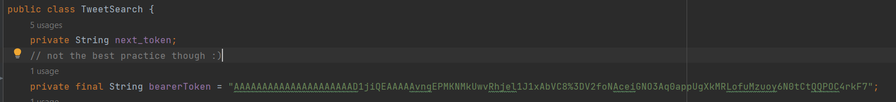

# Twitter Data Extraction

This application searches for Tweets directly from Twitter Using Twitter API. The scope of the search is limited to the activities during the last 7 days on Twitter. It shows the result in a table and allows extracting the results as a CSV file.

## Twitter API  Bearer token
Before attempting to run the app, please insert your token in the TwitterSearch class.

## How to Run it?
Since the project is a maven artifact there are two ways to run it. The first is by running the main method in the Launcher class. If this did not work try running it with maven as in the picture below

## Used Dependencies
* JavaFX-Controls
* JavaFX-Fxml
* Twitter-API-Java-SDK

## Where it could be improved?
Clearly, not all the best practices are applied in this project and there is a massive area of potential improvement. Here are a few potential improvements
* Using a database to store responses instead of depending on a global variable to handle them. 
* Caching: when the user leaves the search page, all his/her results are lost. It is possible to look them up again, but that puts more load on the API and it is not efficient.
* Making the app extendable: will removing or adding something cause many changes everywhere? With the current design, yes.
* Utilizing the Twitter API more: very few of the features that the API provides regarding tweet search have been used.
* More interactive design: adding things like audible alarms or tips on hovering makes it more apparent to the user

## Issues

### Alert not getting executed
In the class 'json', a GUI alert should appear for the user when no matches are found. However, the application gets stuck in the loading animation when no results match the query. The issue might be related to multi-threading.

### The fixed design of the Table that shows the results
In order to cover more attributes and make them available in the order that the user wants, the table insertion and deletion have to be dynamic, and adjustable at run-time.

### Module-based project
When compiling the project the following warning keeps appearing:
"Required filename-based automodules detected. Please don't publish this project to a public artifact repository!"
I guess to resolve the issue a module needed to be built.

